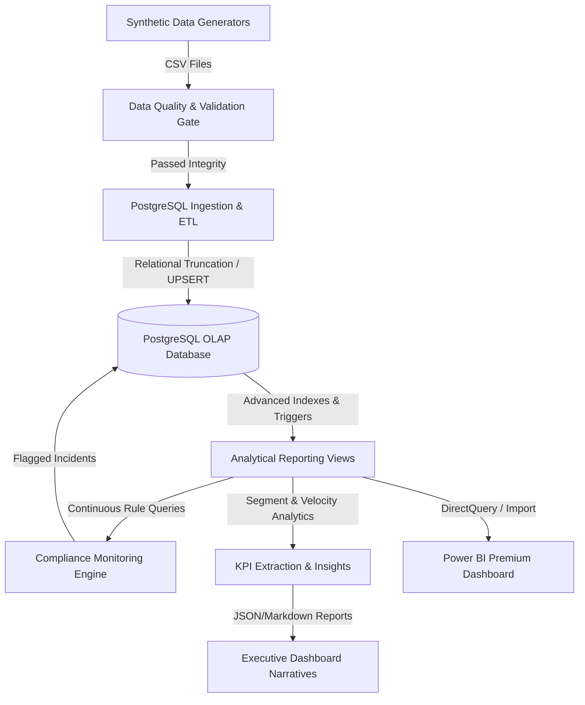
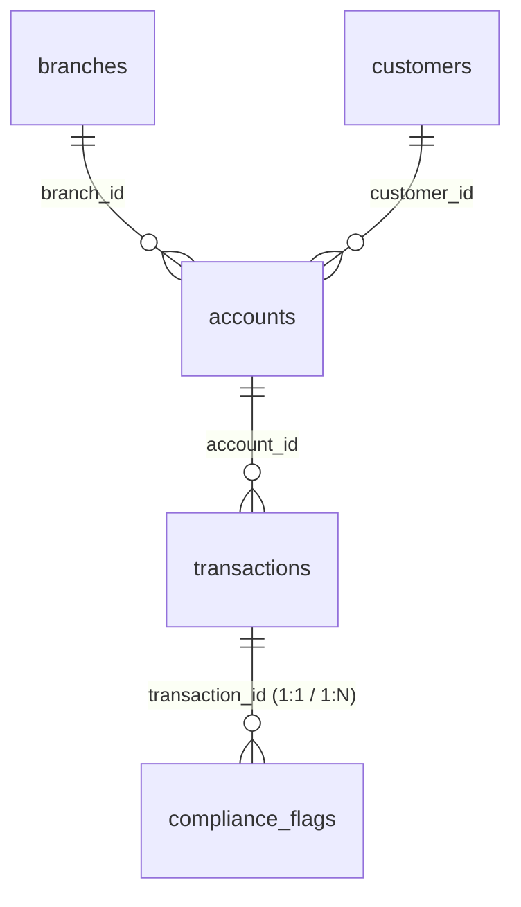

# 🏛️ Banking Operations & Compliance Monitoring Platform
[](https://www.postgresql.org/)
[](https://www.python.org/)
[](https://powerbi.microsoft.com/)
[](https://opensource.org/licenses/MIT)

An enterprise-grade, end-to-end relational data engineering, rule-based algorithmic compliance, and business intelligence platform. This system models a high-throughput commercial retail bank ecosystem—generating, validating, ingesting, auditing, and visualizing millions of data points to deliver sub-second operational and risk intelligence.

---

## 📌 Executive Summary & Key Features
- **Data Engineering Pipeline**: Synthetic generation, strict quality validation, and high-performance bulk ETL ingestion into PostgreSQL.
- **Relational Integrity**: A robust Star Schema enforcing structural integrity via foreign keys, cascading deletes, and check constraints.
- **Algorithmic Compliance Monitoring (AML)**: Automated detection engine scanning ledgers for structuring, velocity anomalies, and high-risk behavior to generate FinCEN-style audit flags.
- **Automated KPI Extraction**: Python-driven analytics extracting top-level metrics (Success Rates, Volume, Suspicious Flag Ratios) to JSON for executive summaries.
- **Executive Dashboarding**: Custom Power BI dashboard with dynamic DAX calculations for cross-filtering, heatmaps, and MoM trend analytics.

---

## 🗺️ System Architecture

The platform is designed around a decoupled, modern data stack that moves data from synthetic generation to high-performance operational dashboards:



---

## 📊 Relational Database Design & Star Schema

The backend database implements a highly optimized **Star Schema** in **PostgreSQL** that enforces structural integrity via foreign keys, cascading deletes, domain check constraints, and custom indexing schemas to maximize analytical query performance:



### 🗄️ Relational Schema Breakdown
1. **`branches` (Dimension)**: Physical and digital branch nodes, organizational metadata, and regional geographic properties.
2. **`customers` (Dimension)**: Complete customer demographic master tables containing KYC validation status codes and segment tiers (`Retail`, `Premium`, `Business`).
3. **`accounts` (Dimension)**: Retail checking, savings, fixed deposit, and current accounts mapping customers to branches with dynamic balance snapshots.
4. **`transactions` (Fact Table)**: High-frequency ledger recording deposits, payments, ATM withdrawals, and transfers, capturing channel, payment method, direction (`Credit`/`Debit`), and execution status.
5. **`compliance_flags` (Fact/Bridge Table)**: Relational audit log representing security alerts flagged by the algorithmic rule engine for FinCEN reporting.

---

## ⚙️ Core Components Deep-Dive

### 🛡️ 1. Data Quality & Pre-Load Validation Gate (`data_validator.py`)
To prevent the ingestion of corrupted data into the operational tables, the validation pipeline operates as a **strict pre-load quality gate**:
* **Null Check Constraints**: Inspects critical identifiers (`customer_id`, `account_id`, `transaction_id`, etc.) across all datasets.
* **PK/FK Referential Integrity**: Enforces that all accounts reference verified customers and all transactions map to active registered accounts.
* **Business Rule Validation**: Scans for financial logic violations (e.g. non-positive transaction amounts, transactions mapped to closed accounts, etc.).
* **Outlier Alert Warnings**: Identifies high-value transfers (> $1M USD) prior to loading to trigger compliance alert pre-checks.

### 🔌 2. High-Performance ETL Ingestion (`etl_pipeline.py`)
Loads validated datasets into the target PostgreSQL database utilizing robust bulk-loading practices:
* **Cascading Relational Truncations**: Safe relational resets (`TRUNCATE ... CASCADE`) that respect foreign key constraints to maintain clean development states.
* **Memory-Optimized Ingestion**: Employs SQLAlchemy engine-level bulk insertion (`method='multi'` with optimized chunks of `10,000` rows) to ingest transactions rapidly.
* **Ingestion Integrity Verification**: Automatically queries operational counts post-ETL to ensure exact row-count matches against source files, generating execution log summaries.

### 🧠 3. Algorithmic Compliance Monitoring Engine (`monitoring_engine.py`)
Runs automated anti-money laundering (AML) and security audit rules over active database ledgers to flag anomalous transactions:

| Rule ID | Name | Trigger Threshold | Risk Level | Target Vector |
| :--- | :--- | :--- | :--- | :--- |
| **`RULE_001`** | **High-Value Alerts** | Transactions exceeding a strict **$10,000** threshold. | `Medium` (Score 65) | Large-cash tracking (BSA guidelines) |
| **`RULE_002`** | **Rapid Transfer Velocity** | **3+ transfers** within a single rolling **1-hour** window. | `High` (Score 85) | Anti-layering & structuring activities |
| **`RULE_003`** | **High-Risk Jurisdictions** | Wire transfers routed to list of offshore tax havens. | `High` (Score 90) | Tax evasion & offshore flight risk |
| **`RULE_004`** | **Sudden Dormancy Wakeup** | Transactions executed on accounts flagged as `Inactive`/`Frozen`. | `Medium` (Score 70) | Account takeover & identity theft |
| **`RULE_005`** | **Failure Velocity Anomalies** | **5+ failed transactions** within a rolling **24-hour** window. | `Medium` (Score 60) | Fraud attempts or system timeouts |

### 📈 4. KPI Analytics & Business Insight Generator (`calculate_kpis.py` & `insight_generator.py`)
- **SQL Analytics**: Utilizes `kpi_metrics.sql` and `analytics_queries.sql` to execute complex statistical window functions, aggregations, and performance SLA metrics on the PostgreSQL tables.
- **KPI Extraction**: The `calculate_kpis.py` script computes peak transaction hours, failure rate percentages, and total processing volumes, saving output directly to `data/outputs/summary_kpis.json`.
- **Insight Generation**: Compiles executive briefings on service availability, compliance risk concentrations, and throughput fluctuations based on the computed KPIs.

---

## 🎨 Power BI Executive Dashboard Architecture

The frontend is structured to deliver an executive-level interactive presentation built upon premium fintech design principles:

### 🌟 UX/UI Design Specifications
* **Fintech Visual Identity**: A high-end dark-mode theme utilizing a Deep Slate canvas (`#0b0f19`) and glassmorphic card containers (`#1e293b`) to maximize visual contrast.
* **Consistent Semantic Accents**: 
  * 🟢 **Emerald Mint (`#10b981`)**: Operational successes and transaction growth.
  * 🔴 **Crimson Coral (`#f43f5e`)**: High-risk compliance flags and system failure alerts.
  * 🟡 **Amber Gold (`#f59e0b`)**: Warnings, pending reviews, and SLA boundaries.
  * 🔵 **Indigo Blue (`#6366f1`)**: Baseline volumes and passive time-series metrics.
* **Typography Hierarchy**: Structured font scaling leveraging **Inter** and **Segoe UI** to draw eyes immediately to critical KPI metrics.

### 🖥️ Page-by-Page Specifications
1. **Executive Overview Page**: Core metrics for high-level executives. Tracks total volume, system processing capacity, active user metrics, and geographical regional mapping.
2. **Operations Monitoring Page**: Matrix heatmaps mapping peak transactional hours, payment channel preference distributions, and detailed card transaction error breakdowns.
3. **Compliance & Risk Page**: Live risk queue featuring Horizontal Clustered Bar Charts of rule violations, risk concentrations across customer tiers, and an actionable pending review queue.
4. **Customer Insights Page**: Scatter plots correlating spending frequency, average ticket sizes, and overall account balances alongside categorical retail spending treemaps.

---

## 📐 Dynamic DAX Measures & Formulas Library

To achieve dynamic, responsive visuals with sub-second cross-filtering, the platform utilizes a library of optimized DAX calculations:

### Base Transactions & Volumes
```dax
-- Counts the total transaction events in the ledger
Total Transactions = COUNT(transactions[transaction_id])

-- Calculates the gross monetary throughput of the platform
Total Transaction Volume = SUM(transactions[amount])

-- Computes the average value per transaction
Average Transaction Amount = AVERAGE(transactions[amount])
```

### Operational SLAs & Success Rates
```dax
-- Base helper measure for successful payments
Completed Transactions = 
CALCULATE(
    [Total Transactions],
    transactions[status] = "Completed"
)

-- Measures operational efficiency against service level SLAs with divide-by-zero protection
Success Rate = 
DIVIDE(
    [Completed Transactions],
    [Total Transactions],
    0
)

-- Calculates operational error ratios
Failed Transaction Percentage = 
DIVIDE(
    CALCULATE([Total Transactions], transactions[status] = "Failed"),
    [Total Transactions],
    0
)
```

### Dynamic Risk Rankings & MoM Growth
```dax
-- Ranks branches dynamically by volume, ignoring customer/date selection context
Branch Activity Ranking = 
IF(
    ISINSCOPE(branches[branch_name]),
    RANKX(
        ALLSELECTED(branches[branch_name]),
        [Total Transaction Volume],
        ,
        DESC,
        Dense
    ),
    BLANK()
)

-- Evaluates alert trends comparing the current month to the previous month
Alert Count MoM Growth = 
VAR CurrentMonthAlerts = COUNT(compliance_flags[flag_id])
VAR PreviousMonthAlerts = 
    CALCULATE(
        COUNT(compliance_flags[flag_id]),
        DATEADD('Calendar'[Date], -1, MONTH)
    )
RETURN
    DIVIDE(
        CurrentMonthAlerts - PreviousMonthAlerts,
        PreviousMonthAlerts,
        0
    )
```

---

## 🚀 Quick Start Setup & Execution Guide

Follow these steps to deploy the local PostgreSQL database, ingest the synthetic datasets, run the rule engines, and load the dashboard:

### 1. Clone & Set Up Virtual Environment
```bash
# Clone the repository
git clone https://github.com/alonsobern/banking-operations-compliance-platform.git
cd banking-operations-compliance-platform

# Create virtual environment
python -m venv venv
source venv/bin/activate  # On Windows: .\venv\Scripts\activate

# Install required analytical dependencies
pip install -r requirements.txt
```

### 2. Configure Local Environment Variables
Create a `.env` file in the root directory (based on `.env.example`):
```env
DB_HOST=localhost
DB_PORT=5432
DB_NAME=banking-platform
DB_USER=postgres
DB_PASSWORD=your_secure_password
```

### 3. Generate & Validate Data
Generate 117K+ rows of clean banking data and verify structural integrity before load:
```bash
python src/generators/run_all.py
python src/database/data_validator.py
```

### 4. Deploy Schema & Ingest Data
Deploy the optimized PostgreSQL tables and execute the high-speed bulk ingestion pipeline:
```bash
# Set up empty schemas and indexes in your local Postgres instance
python src/database/init_db.py

# Execute bulk loading and relational verification
python src/database/etl_pipeline.py
```

### 5. Run Analytics, Compliance & KPI Extraction
Deploy reporting views, scan ledgers for AML violations, and extract top-level JSON KPIs:
```bash
# 1. Deploy Power BI-optimized SQL Views
python src/database/deploy_analytics.py

# 2. Run Compliance Detection Engine to generate audit alerts
python src/compliance/monitoring_engine.py

# 3. Calculate metrics & Top-level KPIs
python src/database/calculate_kpis.py

# 4. Generate automated executive dashboard insights markdown summaries
python src/reporting/insight_generator.py
```

### 6. Launch Dashboards
Open `Banking_Operations_Compliance_Dashboard.pbix` in **Power BI Desktop**, click **Refresh** on the Home tab to sync with PostgreSQL, and explore the interactive compliance, operational, and risk insights.

---

## 📂 Repository Blueprint

```text
├── data/
│   ├── raw/                       # Generated CSV datasets
│   └── outputs/                   # Extracted JSON KPI summaries
├── sql/
│   ├── schema.sql                 # Primary PostgreSQL schemas & constraints
│   ├── reporting_views.sql        # Power BI-optimized analytical views
│   ├── kpi_metrics.sql            # Aggregations for Executive KPIs
│   └── analytics_queries.sql      # Advanced database auditing & metric queries
├── src/
│   ├── generators/                # High-fidelity synthetic generation scripts
│   ├── database/                  # ETL core, validators, and KPI calculators
│   ├── compliance/                # Algorithmic AML & KYC Rule detection engines
│   └── reporting/                 # Automated Executive Summaries exporter
├── dashboards/
│   ├── ux_ui_style_guide.md       # Color, spacing, and typography guidelines
│   ├── power_bi_dashboard_design.md# Canvas grid and page structures layout
│   ├── power_bi_dax_measures.dax  # Calculation measure formula libraries
│   └── business_insights_examples.md# Text-narrative insight templates
├── tests/
│   └── validate_data.py           # Unit testing and key integrity validators
├── requirements.txt               # System runtime dependencies list
├── .env.example                   # Local configuration environment templates
└── README.md                      # Comprehensive project documentation
```

---
*Developed with enterprise-grade engineering rigor to serve as a gold-standard portfolio showcase for financial tech data engineering and business intelligence systems.*
