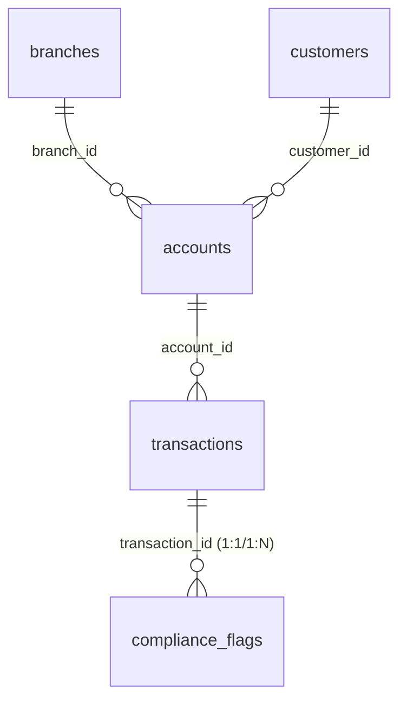

# Power BI Dashboard Architecture & Design Plan
## Banking Operations & Compliance Monitoring Platform

This document outlines the professional Power BI dashboard structure, visual layouts, data model, and storytelling flow optimized for the Banking Operations and Compliance Monitoring Platform.

---

## 🎨 Theme & Visual Identity

To deliver a premium, modern fintech aesthetic, we establish a clean, dark-mode design system. This enhances readability for executive monitoring and reduces eye strain for compliance analysts during long review sessions.

*   **Primary Background**: Slate Black / Dark Charcoal (`#0f172a` / `#0b0f19`)
*   **Card Containers**: Glassmorphism Effect / Deep Slate (`#1e293b` with a subtle `1px` border of `#334155` and `8px` rounded corners)
*   **Accents & Categorical Colors**:
    *   **Operational Success / Completed**: Clean Teal / Mint Green (`#0d9488` / `#10b981`)
    *   **Compliance Alerts / High Risk**: Coral Red / Rose (`#f43f5e` / `#e11d48`)
    *   **Medium Risk / Warnings**: Amber / Gold (`#f59e0b` / `#d97706`)
    *   **Passive Data / Volume**: Slate Blue / Indigo (`#6366f1` / `#3b82f6`)
*   **Typography**: Inter / Segoe UI (Clean, high-legibility sans-serif)

---

## 📊 Data Model & Schema Relationships

To achieve high scalability and sub-second rendering, we implement a **Star Schema** within Power BI:



### 1. Fact Tables
*   **`transactions`**: High-frequency financial transactions.
*   **`compliance_flags`**: Alerts generated by the Compliance Detection Engine.

### 2. Dimension Tables
*   **`customers`**: Demographics and KYC verification status.
*   **`accounts`**: Financial products (checking, savings) linked to branches and customers.
*   **`branches`**: Geographic locations and physical branch details.
*   **`Calendar (Date Dimension)`**: A standard, auto-generated Power BI date table to support time intelligence.

---

## 🖥️ Page-by-Page Dashboard Specifications

### 1. Executive Overview Page
**Storytelling Goal**: A single pane of glass showing high-level operational health, liquidity trends, and overall compliance status.

#### **Recommended KPIs**
*   **Total Financial Throughput (USD)**: `SUM(transactions[amount])`
*   **Success Rate (SLA)**: `% of Completed Transactions`
*   **Compliance Flag Rate**: `% of Transactions Flagged`
*   **Active Customer Base**: `DISTINCTCOUNT(customers[customer_id])`

#### **Recommended Visuals**
1.  **Dual Y-Axis Combo Chart**:
    *   **Bars**: Monthly Transaction Volume (USD)
    *   **Line**: Success Rate (%)
    *   *Purpose*: Quickly correlates system growth with service level health.
2.  **Geographical Bubble Map**:
    *   **Location**: `branches[state]` or `branches[city]`
    *   **Size**: Total Volume (USD)
    *   **Color**: Flag Rate (%)
    *   *Purpose*: Pinpoints geographic regions driving volume vs. risk exposure.
3.  **Risk Alert Sparkline**: Line chart showing daily alert volume over the past 30 days to highlight sudden volatility spikes.

#### **Layout Suggestion**
*   **Top Row**: Row of 4 KPI cards with glassmorphism backgrounds.
*   **Center Left (Large)**: Combo chart showing monthly volume and success rates.
*   **Center Right**: Geographical Map.
*   **Right Sidebar**: KPI variance indicators (YoY % Change) and quick filters for Region and Segment.

---

### 2. Operations Monitoring Page
**Storytelling Goal**: Focuses on operational efficiency, diagnosing system performance drops, and recognizing peak-hour patterns.

#### **Recommended KPIs**
*   **Transaction Volume**: Total transaction count.
*   **System Error Rate**: Percentage of failed transactions.
*   **Lost Opportunity Cost (USD)**: Total volume of failed transactions.
*   **Peak Load Hour**: Hour with highest activity.

#### **Recommended Visuals**
1.  **Matrix Heatmap**:
    *   **Rows**: Day of Week
    *   **Columns**: Hour of Day
    *   **Value Color Intensity**: Transaction Volume
    *   *Purpose*: Instantly identifies peak server loads for maintenance planning.
2.  **Donut Chart (Failure Reasons)**:
    *   **Legend**: `transactions[failure_reason]` (e.g., Insufficient Funds, Timeout)
    *   **Values**: Transaction Count
    *   *Purpose*: Guides IT operations to address the root causes of failed payments.
3.  **Stacked Area Chart**:
    *   **X-Axis**: Transaction Date
    *   **Y-Axis**: Transaction Volume
    *   **Legend**: Channel (ATM, Online, Branch)
    *   *Purpose*: Monitors customer adoption rates and shifts in digital banking.

#### **Layout Suggestion**
*   **Left Column**: Stacked list of operational KPI cards.
*   **Top Center**: Donut chart of failure reasons alongside failure rate trends.
*   **Bottom Full Width**: Activity Heatmap spanning Hours vs. Days.

---

### 3. Compliance & Risk Page
**Storytelling Goal**: Empowers AML (Anti-Money Laundering) and KYC (Know Your Customer) compliance officers to prioritize their daily investigation queues.

#### **Recommended KPIs**
*   **Total Flags Outstanding**: Count of `compliance_flags` in 'Pending Review'.
*   **Critical Alerts**: Alerts with risk score > 80.
*   **Average Risk Score**: Mean value of `compliance_flags[risk_score]`.
*   **KYC Expired/Pending Rate**: Percentage of customers with unverified profiles.

#### **Recommended Visuals**
1.  **Horizontal Clustered Bar Chart**:
    *   **Y-Axis**: `compliance_flags[rule_id]` (e.g., RULE_001, RULE_002)
    *   **X-Axis**: Alert Count
    *   **Color Scale**: Risk Level (Red for Critical, Amber for Medium)
    *   *Purpose*: Evaluates which compliance rules are generating the most flags.
2.  **Clustered Column Chart**:
    *   **X-Axis**: `customers[customer_segment]`
    *   **Y-Axis**: Flagged Volume (USD)
    *   **Legend**: Risk Level
    *   *Purpose*: Visualizes risk concentration across Retail, Premium, and Business accounts.
3.  **Analyst Investigation Queue (Detail Table)**:
    *   **Columns**: `flag_id`, `Customer_Name`, `risk_level`, `risk_score`, `flag_reason`, `flagged_at`, `status`.
    *   *Purpose*: Directly actionable table for compliance workflows.

#### **Layout Suggestion**
*   **Top Column**: Summary KPI indicators highlighting "Critical Flags".
*   **Left Half**: Rule Breakdown and Segment Risk column charts.
*   **Right Half / Bottom**: Full-width detail table representing the active compliance queue with cross-filtering active.

---

### 4. Customer Insights Page
**Storytelling Goal**: Analyzes customer segmentation, product preferences, and wealth profiles to assist business development and marketing.

#### **Recommended KPIs**
*   **Unique Customer Base**: Total customer count.
*   **Avg Customer Balance**: Average value of accounts.
*   **Customer Lifetime Value (LTV)**: Average total transaction volume per customer.
*   **Premium Segment Growth**: YoY customer growth in Premium tier.

#### **Recommended Visuals**
1.  **Scatter Plot**:
    *   **X-Axis**: Average Transaction Size
    *   **Y-Axis**: Transaction Frequency (Count)
    *   **Bubble Size**: Total Account Balance
    *   **Legend**: Customer Segment
    *   *Purpose*: Segments customers into High-Value Frequent, Low-Value Frequent, and High-Value Dormant categories.
2.  **Treemap (Spending Categories)**:
    *   **Grouping**: `transactions[merchant_category]`
    *   **Size**: Total Volume (USD)
    *   *Purpose*: Displays top retail sectors where banking customers spend.
3.  **100% Stacked Bar Chart (Channel Preference)**:
    *   **Y-Axis**: Segment
    *   **X-Axis**: Transaction Count (%)
    *   **Legend**: Channel (Online, ATM, Branch)
    *   *Purpose*: Drives marketing strategy for customer channel migration.

#### **Layout Suggestion**
*   **Left Side**: Interactive slicer pane (Age bracket, State, Annual income range).
*   **Center Grid**: Scatter Plot (top) and Spending Treemap (bottom).
*   **Right Sidebar**: Detailed segment statistics.

---

## 📈 Power BI Dax Measures

Implement these optimized measures to support dynamic dashboard reporting:

```dax
-- 1. Total Volume
Total_Volume = SUM(transactions[amount])

-- 2. Success Rate %
Success_Rate_Pct = 
DIVIDE(
    CALCULATE(COUNT(transactions[transaction_id]), transactions[status] = "Completed"),
    COUNT(transactions[transaction_id]),
    0
) * 100

-- 3. Alert Volume
Alert_Count = COUNT(compliance_flags[flag_id])

-- 4. Alert Rate %
Alert_Rate_Pct = 
DIVIDE(
    [Alert_Count],
    COUNT(transactions[transaction_id]),
    0
) * 100

-- 5. Risk Alert Variance (Month-over-Month)
Alerts_MoM_Growth = 
VAR CurrentMonthAlerts = [Alert_Count]
VAR PreviousMonthAlerts = CALCULATE([Alert_Count], DATEADD('Calendar'[Date], -1, MONTH))
RETURN
DIVIDE(
    CurrentMonthAlerts - PreviousMonthAlerts,
    PreviousMonthAlerts,
    0
)
```

---
*Document Status: Completed Design Phase | Ready for Power BI Implementation*
